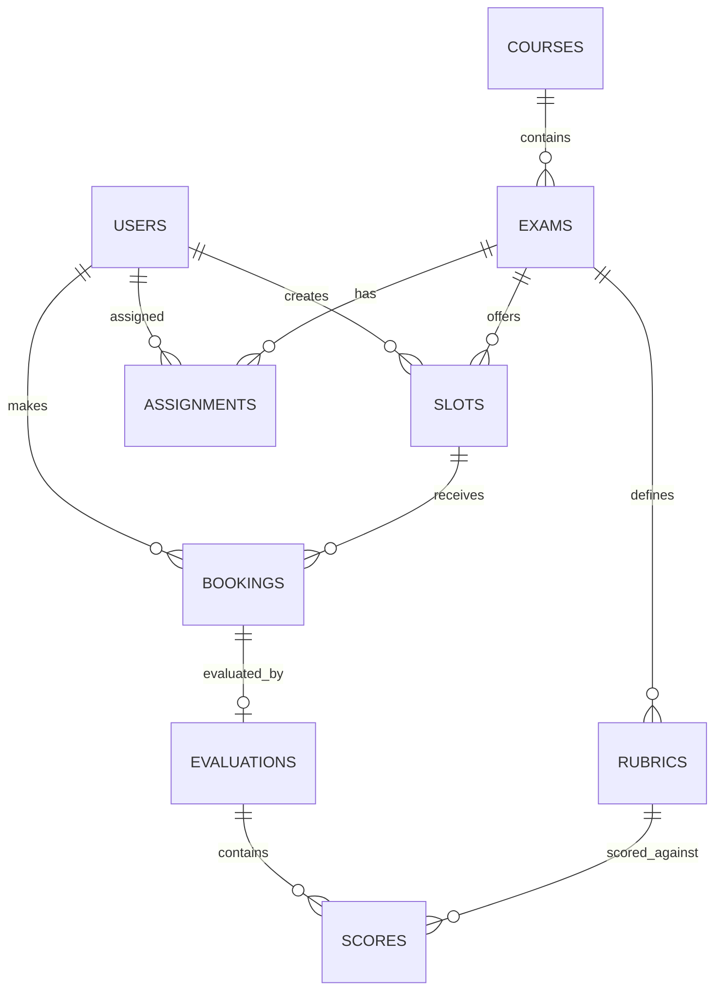

# ER diagram (Mermaid)

```mermaid
erDiagram
 USERS ||--o{ SLOTS : creates
 USERS ||--o{ BOOKINGS : makes
 USERS ||--o{ ASSIGNMENTS : assigned
 COURSES ||--o{ EXAMS : contains
 EXAMS ||--o{ RUBRICS : defines
 EXAMS ||--o{ SLOTS : offers
 EXAMS ||--o{ ASSIGNMENTS : has
 SLOTS ||--o{ BOOKINGS : receives
 BOOKINGS ||--o| EVALUATIONS : evaluated_by
 EVALUATIONS ||--o{ SCORES : contains
 RUBRICS ||--o{ SCORES : scored_against
```
